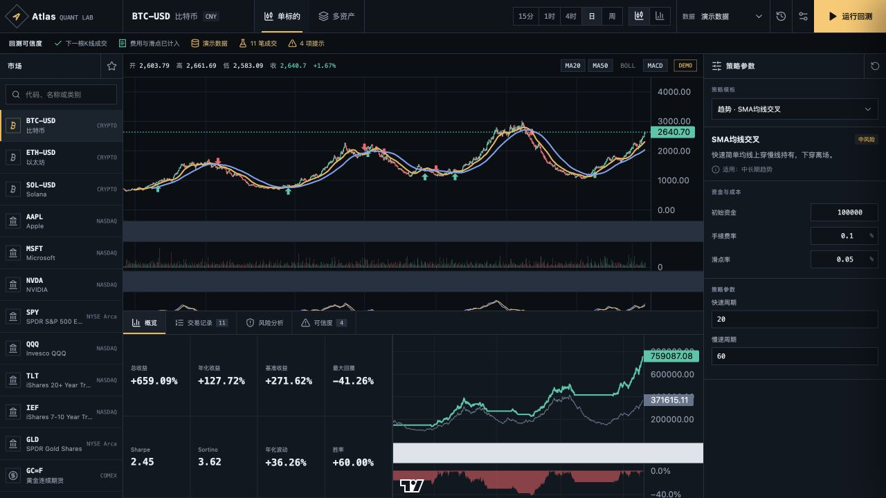
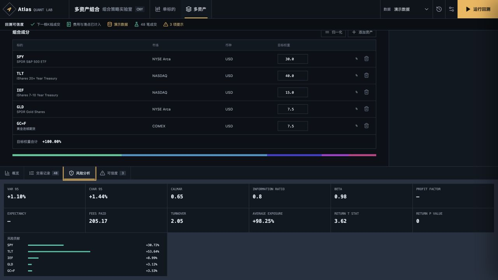

# Atlas Quant Lab

> Strategy developers: see [Atlas Strategy Lab](docs/STRATEGY_DEVELOPMENT.md) for the `.qstrategy` package, Python SDK, private Runner contract, AI workflow permissions, and production safety boundary.

Atlas Quant Lab 是一个个人本地使用、前后端分离的多资产策略研究与历史回测平台。它提供交易终端式 K 线工作台、常见策略参数化回测、交易标记、风险指标、交易明细，以及全天候、风险平价等多资产组合实验室。

> 本项目只用于研究和历史模拟，不连接实盘账户，也不构成投资建议。

## 核心能力

- 多资产：加密货币、A/H 股、美股、ETF、指数、外汇和商品。
- 多周期：15 分钟、1 小时、4 小时、日线和周线。
- 单标的策略：定投、网格、马丁/反马丁、均线、MACD、RSI、布林带、突破和动量。
- 组合策略：全天候、风险平价和 60/40 再平衡。
- 可信回测：下一根 K 线成交、手续费、滑点、价差、样本量警告、样本外与市场阶段分析。
- 可视化：K 线、成交量、MACD、买卖标记、权益与回撤曲线、交易记录；VOL/MACD 可独立开关。
- 真实行情：加密货币使用 Binance，美股/ETF/A 股/外汇/商品使用新浪广覆盖行情，港股使用腾讯并配置分钟线补充源，Yahoo 作为兼容备选；真实源失败时明确报错，不会伪造演示 K 线。
- 流畅交互：行情定时增量刷新、短时缓存、响应压缩、请求取消与图表原位更新。
- 可调布局：左侧市场、右侧策略、底部结果均可拖动调整，价格轴保留安全宽度；回测结果可收起、还原或最大化。
- 参数化研究：每个单标的策略提供 4–5 个有实际信号影响的专属参数，并共享仓位上限、成交量参与率、止损和止盈等风控设置。
- 策略实验室：把规则构建、AI 工作流、研究验证、私密版本包和 SDK 收敛到 `DRAFT → COMPOSE → VALIDATE → VERSION` 生命周期；切换阶段保留编辑状态，并可从 QuantJudge 一键返回开发上下文。
- 策略验证：并行比较多个策略、受限参数网格、独立留出集、Walk-forward 滚动验证、过拟合警告和稳健性排名；任务在后端异步执行并可取消。
- 可视化规则构建器：用指标、比较关系和 AND/OR 条件组合策略，模板持久化到本地；只执行受控 DSL，不执行用户代码。
- 历史回放：逐根推进 K 线且严格隐藏未来数据，支持播放、单步、带手续费与滑点的模拟买卖，并按标的恢复回放进度。
- 提醒中心：支持价格、单根涨幅、RSI 和 MACD 条件；后端独立轮询、冷却去重、通知持久化，并可选浏览器桌面通知。
- 统一口径：CNY、USD、USDT 基准币种与自动/前复权/后复权/不复权设置。
- 本地优先：不需要注册，行情缓存、策略模板和回测历史保存在本机。
- QuantJudge 市场：量化策略 / AI Agent 公开跑分、分类排行、证据账本、本地沙盒订阅和开发者发布流程。
- 隐私证明：固定 RISC Zero zkVM guest 可证明私密 SMA 参数确实在指定行情和成本模型上生成公开业绩；服务器只持久化 receipt、公开 journal 和承诺，不保存 witness、参数或逐笔决策。其他策略类型不会冒充 ZKP。
- Supervisor 验证：通过独立 JSON-RPC 适配器读取链 ID、区块与交易回执；只接收外部钱包已签名交易，平台不保管链上私钥。

## 目录

```text
backend/   FastAPI、行情适配、指标、策略、回测与本地存储
frontend/  React + TypeScript 交易工作台
docs/      PRD、架构、API 和数据口径
```

## 本地启动

### 后端

```bash
cd backend
python3 -m venv .venv
source .venv/bin/activate
pip install -r requirements.txt
uvicorn app.main:app --reload --port 8000
```

### 前端

```bash
cd frontend
pnpm install
pnpm dev
```

访问 `http://localhost:5173`。前端默认连接 `http://localhost:8000/api/v1`。

## 测试

```bash
cd backend && .venv/bin/pytest
cd frontend && pnpm test && pnpm build
```

页面中的 K 线使用标的原始报价币种。顶部“组合基准币种”仅用于多资产组合回测的历史汇率换算。`演示数据` 必须手动选择，适合离线体验与测试，不代表真实市场。

研究任务和提醒监控由后端进程承载；关闭后端会停止新任务和行情轮询，但已保存的策略、任务结果、提醒规则与通知不会丢失。

QuantJudge 默认使用 `http://127.0.0.1:42515` 读取 Supervisor JSON-RPC，可通过 `QUANTJUDGE_SUPERVISOR_RPC_URL` 修改。未连接 Supervisor 时仍可发布和验证本地密码学回执，但界面会明确标记为“待锚定”，不会冒充链上确认。

更多信息见 [产品规格](docs/PRD.md)、[系统架构](docs/ARCHITECTURE.md)、[ZKP 协议与威胁模型](docs/ZKP.md) 和 [QuantJudge 证明与链接入](docs/QUANTJUDGE.md)。

## 界面预览




